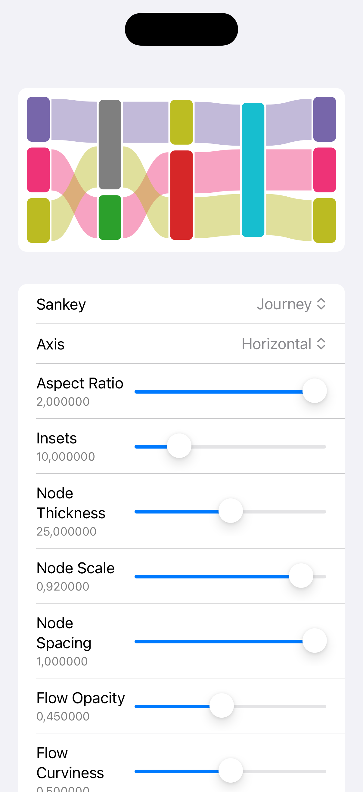

# SankeyKit (Work in progress)

SankeyKit is a Swift package for creating Sankey diagrams. It allows easy creation of nodes, adding flows, and initializing from a SankeyMatic string representation.



## Installation

SankeyKit can be installed via Swift Package Manager (SPM).

1. Open your Xcode project.
2. Go to **File > Add Packages**.
3. Enter the URL of your repository.
4. Select the desired version and add the package.

Alternatively, you can add it directly to your `Package.swift` file:

```swift
.package(url: "https://github.com/cpageler93/SankeyKit.git", from: "1.0.0")
```

## Usage

### Creating a Sankey Diagram

```swift
import SankeyKit

var sankey = Sankey()
let a = sankey.addNodeIfNeeded(title: "A")
let b = sankey.addNodeIfNeeded(title: "B")
sankey.addFlow(from: a, value: 2, to: b)
```

### Initializing from a SankeyMatic String Representation

```swift
let string = """
// Sample Financial Results diagram:

DivisionA [900] Revenue
DivisionB [750] Revenue
DivisionC [150] Revenue

Revenue [800] Cost of Sales
Revenue [1000] Gross Profit

Gross Profit [10] Amortization
Gross Profit [640] Selling, General & Administration
Gross Profit [350] Operating Profit

Operating Profit [90] Tax
Operating Profit [260] Net Profit

// Profit - blue
:Gross Profit #48e <<
:Operating Profit #48e <<
:Net Profit #48e <<

// Expenses - rust
:Tax #d97 <<
:Selling, General & Administration #d97 <<
:Amortization #d97 <<

// Cost - gray
:Cost of Sales #bbb <<

// main Revenue node: dark grey
:Revenue #555
""" as SankeyMaticString

let sankey = try string.initSankey()
```

## License

This project is licensed under the MIT License. See the `LICENSE` file for more details.
